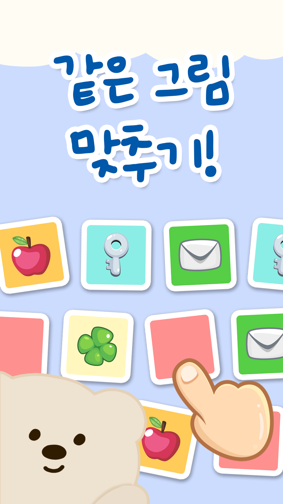

# 🎮 카드 매칭 게임

귀여운 파스텔 스타일의 메모리 카드 게임입니다. p5.js로 구현되었으며, Soft Toy/Plushie aesthetic 디자인을 적용했습니다.



## ✨ 주요 특징

- 🎨 **귀여운 디자인**: 부드러운 파스텔 톤과 귀여운 곰 캐릭터
- 🎯 **5가지 난이도**: 하, 중, 상, 재앙, 지옥
- ⚡ **부드러운 애니메이션**: 카드 뒤집기, 호버 효과, 파티클 효과
- 🏆 **점수 시스템**: 시간, 시도 횟수 기반 점수 계산
- 📱 **반응형 디자인**: 데스크톱과 모바일 모두 지원

## 🚀 빠른 시작

### 필요 조건
- 웹 브라우저 (Chrome, Firefox, Safari, Edge)
- 로컬 웹 서버 (선택사항, 권장)

### 실행 방법

#### 방법 1: 직접 열기
```bash
# 프로젝트 디렉토리로 이동
cd card-matching-game

# index.html 파일을 브라우저로 열기
open index.html  # macOS
start index.html # Windows
xdg-open index.html # Linux
```

#### 방법 2: 로컬 서버 실행 (권장)

**Python 사용:**
```bash
# Python 3
python -m http.server 8000

# Python 2
python -m SimpleHTTPServer 8000
```

**Node.js 사용:**
```bash
# npx 사용 (Node.js 설치 필요)
npx http-server -p 8000
```

**VS Code Live Server:**
1. VS Code에서 프로젝트 열기
2. Live Server 확장 설치
3. index.html에서 우클릭 → "Open with Live Server"

브라우저에서 `http://localhost:8000` 접속

## 🎮 게임 방법

### 기본 규칙
1. 카드를 두 장씩 뒤집어 같은 그림을 찾습니다
2. 짝이 맞으면 카드가 사라집니다
3. 모든 짝을 찾으면 게임 클리어!
4. 제한 시간 내에 클리어하세요

### 난이도별 특징

| 난이도 | 카드 수 | 시간 제한 | 페널티 | 특징 |
|--------|---------|-----------|--------|------|
| **하** | 12장 (6쌍) | 3분 | 5초 | 초보자용 |
| **중** | 16장 (8쌍) | 2분 | 10초 | 중간 난이도 |
| **상** | 20장 (10쌍) | 1.5분 | 15초 | 도전적 |
| **지옥** | 30장 (15쌍) | 1분 | 20초 | 최고 난이도 |

### 키보드 단축키
- **ESC**: 게임 리셋
- **D**: 디버그 모드 (카드 경계선 표시)
- **G**: 게임 상태 콘솔 출력

### 브라우저 콘솔 디버그 명령어
```javascript
debugState()      // 게임 상태 출력
debugCards()      // 모든 카드 정보 출력
debugWin()        // 강제 게임 클리어 (테스트용)
debugSetTime(60)  // 시간 설정 (테스트용)
```

## 🎨 디자인 시스템

자세한 디자인 가이드는 [DESIGN_GUIDE.md](DESIGN_GUIDE.md)를 참고하세요.

### 컬러 팔레트
- **배경**: 연한 파란색 (#C8D8F0)
- **카드 뒷면**: 핑크 (#FFB4D1)
- **카드 앞면**: 6가지 파스텔 컬러
- **캐릭터**: 베이지색 곰 (#E8D4B8)

### 폰트
- **Pretendard**: 메인 폰트 (깔끔한 한글)
- **Noto Sans KR**: 보조 폰트

## 📁 프로젝트 구조

```
card-matching-game/
├── index.html              # 메인 HTML 파일
├── README.md               # 프로젝트 설명 (이 파일)
├── DESIGN_GUIDE.md         # 디자인 시스템 가이드
├── PROJECT_OVERVIEW.md     # 프로젝트 개요 및 기획
│
├── css/
│   └── style.css           # 전역 스타일
│
├── js/
│   ├── config.js           # 게임 설정 (난이도, 점수 등)
│   ├── main.js             # p5.js 메인 진입점
│   │
│   ├── core/               # 데이터 모델
│   │   ├── Card.js         # 카드 클래스
│   │   └── GameState.js    # 게임 상태 관리
│   │
│   ├── logic/              # 비즈니스 로직
│   │   ├── CardManager.js  # 카드 생성/관리
│   │   └── GameManager.js  # 게임 로직
│   │
│   ├── rendering/          # UI 렌더링
│   │   ├── CardRenderer.js # 카드 렌더링
│   │   ├── UIRenderer.js   # UI 화면 렌더링
│   │   └── ParticleSystem.js # 파티클 효과
│   │
│   └── utils/              # 유틸리티
│       ├── ArrayUtils.js   # 배열 처리
│       ├── GridCalculator.js # 그리드 계산
│       ├── SoundManager.js # 효과음 관리
│       └── HighScoreManager.js # 점수 기록
│
└── assets/
    └── images/
        └── cards/          # 레퍼런스 이미지
            ├── 1.webp
            ├── 2.webp
            ├── 3.webp
            └── 4.webp
```

## 🛠️ 기술 스택

- **p5.js 1.7.0**: 캔버스 기반 그래픽 라이브러리
- **Vanilla JavaScript**: 순수 자바스크립트 (ES6+)
- **CSS3**: 애니메이션 및 반응형 디자인
- **HTML5**: 시맨틱 마크업

## 🎯 개발 로드맵

### 완료된 기능
- ✅ 핵심 게임 로직 구현
- ✅ 귀여운 파스텔 UI 디자인
- ✅ 곰 캐릭터 및 장식 요소
- ✅ 카드 애니메이션 (뒤집기, 매칭)
- ✅ 호버 효과 및 인터랙션
- ✅ 난이도 선택 시스템
- ✅ 점수 및 시간 시스템

### 향후 계획
- 🔄 효과음 추가
- 🔄 배경 음악 (ON/OFF 옵션)
- 🔄 테마 선택 (과일, 커피, 패션)
- 🔄 멀티플레이어 모드
- 🔄 리더보드 (온라인)
- 🔄 모바일 터치 최적화

## 🤝 기여

프로젝트 개선에 기여하고 싶으시다면:

1. Fork this repository
2. Create your feature branch (`git checkout -b feature/AmazingFeature`)
3. Commit your changes (`git commit -m 'Add some AmazingFeature'`)
4. Push to the branch (`git push origin feature/AmazingFeature`)
5. Open a Pull Request

## 📄 라이선스

이 프로젝트는 MIT 라이선스를 따릅니다. 자세한 내용은 [LICENSE](LICENSE) 파일을 참고하세요.

## 👥 제작진

### 개발팀
- **방채민**: 게임 로직, 난이도 설계, 점수 시스템
- **윤현준**: p5.js 통합, 이벤트 처리, 시스템 아키텍처
- **손아영**: 효과음, 이미지 에셋 (예정)

### 디자인
- **Claude Code**: AI 기반 UI/UX 디자인 구현
- **frontend-design skill**: Soft Toy/Plushie aesthetic 적용

## 🙏 감사의 말

- **p5.js**: 훌륭한 그래픽 라이브러리 제공
- **Google Fonts**: Noto Sans KR 폰트 제공
- **Pretendard**: 아름다운 한글 폰트 제공
- **레퍼런스 이미지**: 디자인 영감 제공

## 📞 문의

프로젝트에 대한 질문이나 제안사항이 있으시면:
- Issues 탭에 남겨주세요
- Pull Request를 보내주세요

---

**즐거운 게임 되세요! 🎉**

Made with ❤️ and p5.js
