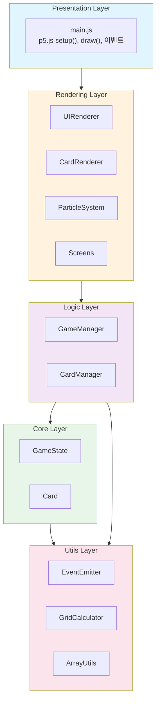
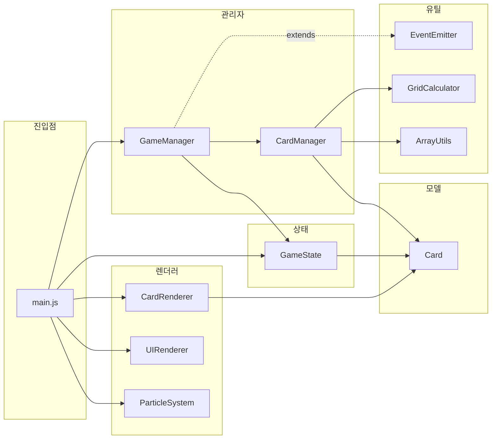
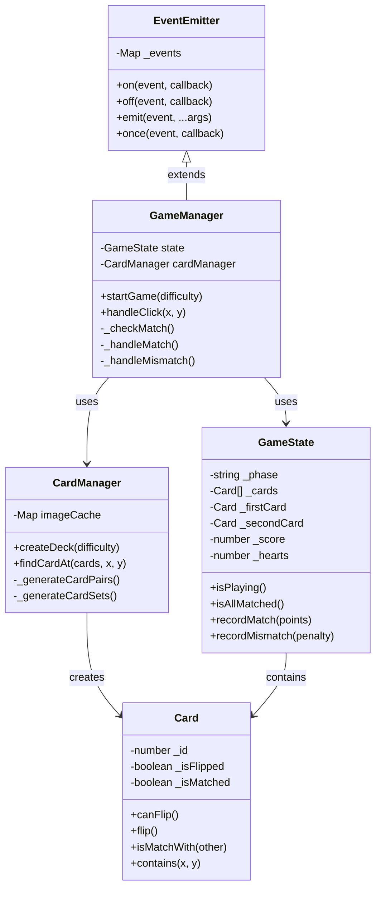
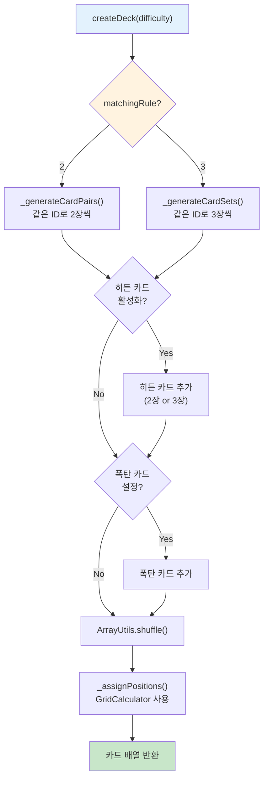
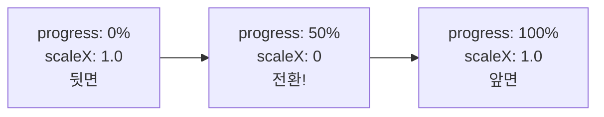
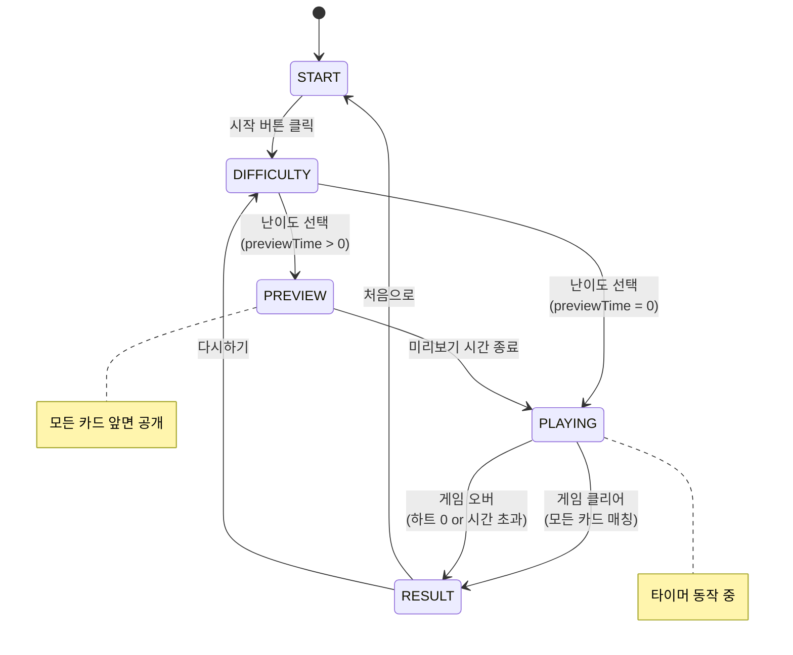
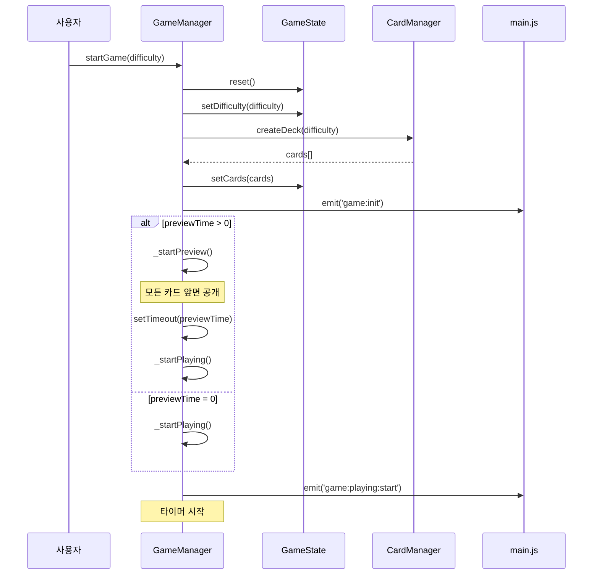
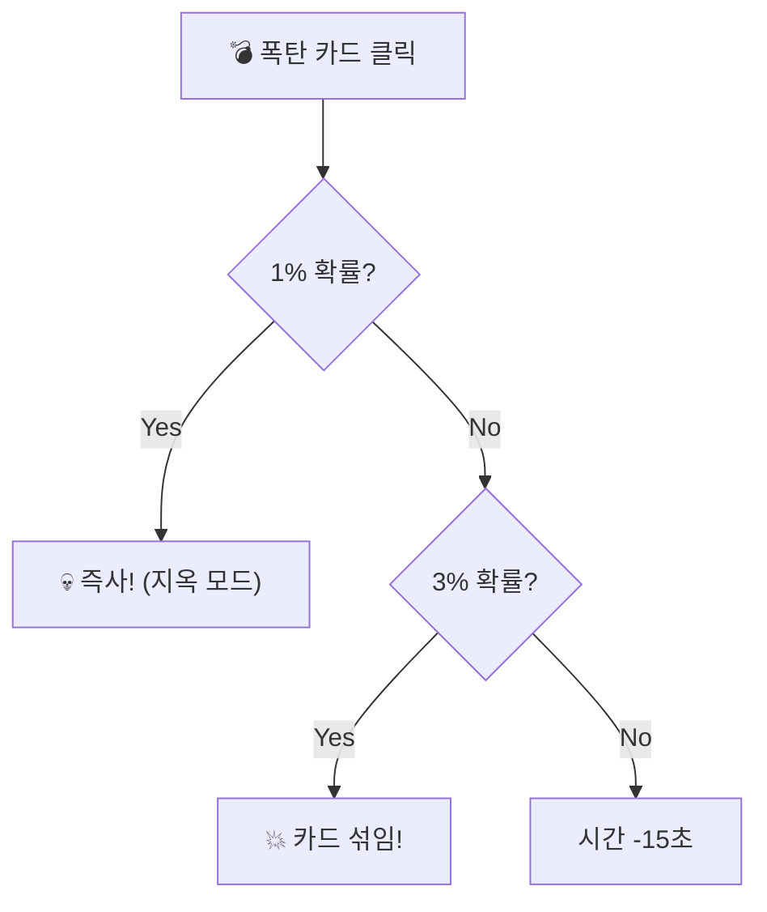
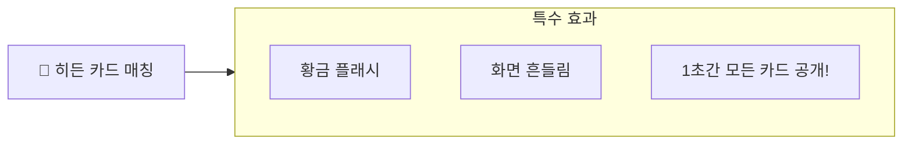

# 카드 매칭 게임 - 기술 발표 자료

---

## 목차

1. [프로젝트 개요](#1-프로젝트-개요)
2. [기술 스택](#2-기술-스택)
3. [아키텍처 설계](#3-아키텍처-설계)
4. [Core Layer - 데이터 모델](#4-core-layer---데이터-모델)
5. [Logic Layer - 비즈니스 로직](#5-logic-layer---비즈니스-로직)
6. [Rendering Layer - 화면 렌더링](#6-rendering-layer---화면-렌더링)
7. [Utils Layer - 유틸리티](#7-utils-layer---유틸리티)
8. [이벤트 시스템 (EventEmitter)](#8-이벤트-시스템-eventemitter)
9. [게임 흐름 및 상태 관리](#9-게임-흐름-및-상태-관리)
10. [난이도 시스템](#10-난이도-시스템)
11. [특수 카드 시스템](#11-특수-카드-시스템)
12. [애니메이션 및 파티클 효과](#12-애니메이션-및-파티클-효과)
13. [핵심 설계 포인트 요약](#13-핵심-설계-포인트-요약)

---

## 1. 프로젝트 개요

### 프로젝트 구조

```
card-matching-game/
├── index.html              # 진입점
├── css/style.css           # 전역 스타일
├── js/
│   ├── config.js           # 게임 설정 (난이도, 카드, 상수)
│   ├── main.js             # p5.js 메인 (setup, draw, 이벤트)
│   │
│   ├── core/               # 데이터 모델 계층
│   │   ├── Card.js         # 카드 클래스
│   │   └── GameState.js    # 게임 상태 관리
│   │
│   ├── logic/              # 비즈니스 로직 계층
│   │   ├── CardManager.js  # 카드 생성/관리
│   │   └── GameManager.js  # 게임 규칙/흐름 제어
│   │
│   ├── rendering/          # 렌더링 계층
│   │   ├── CardRenderer.js # 카드 그리기
│   │   ├── UIRenderer.js   # UI 오케스트레이터
│   │   ├── ParticleSystem.js # 파티클 효과
│   │   └── screens/        # 화면 컴포넌트
│   │       ├── StartScreen.js
│   │       ├── GameScreen.js
│   │       ├── ResultScreen.js
│   │       └── EndingCredits.js
│   │
│   └── utils/              # 유틸리티 계층
│       ├── EventEmitter.js # Observer 패턴
│       ├── GridCalculator.js
│       ├── ArrayUtils.js
│       ├── SoundManager.js
│       ├── HighScoreManager.js
│       └── Logger.js
│
└── assets/
    ├── images/cards/       # 카드 이미지 (18종)
    └── sounds/             # 효과음
```

**총 19개 JavaScript 파일**

---

## 2. 기술 스택

| 분류 | 기술 | 용도 |
|------|------|------|
| **프레임워크** | p5.js 1.7.0 | 캔버스 기반 그래픽/애니메이션 |
| **언어** | Vanilla JavaScript (ES6+) | 순수 JS, 외부 프레임워크 없음 |
| **스타일** | CSS3 + HTML5 | 스타일, 반응형, 접근성 |
| **디자인 패턴** | Observer (EventEmitter) | 컴포넌트 간 느슨한 결합 |
| **아키텍처** | Layered Architecture | 계층 분리 |
| **상태 관리** | 중앙 집중식 (GameState) | 단일 진실 공급원 |

### 왜 p5.js인가?

- **캔버스 기반**: DOM 조작 없이 부드러운 애니메이션
- **60fps draw 루프**: 게임 루프 구현이 간단
- **풍부한 그래픽 API**: 도형, 이미지, 변환, 색상 등
- **학습 곡선 낮음**: 진입 장벽이 낮아 빠른 개발 가능

---

## 3. 아키텍처 설계

### 3.1 계층형 아키텍처 (Layered Architecture)



**의존성 방향**: 위 → 아래 (단방향)

### 3.2 계층 분리의 장점

| 장점 | 설명 |
|------|------|
| **관심사 분리** | 각 계층이 하나의 책임만 담당 |
| **테스트 용이** | 계층별 독립 테스트 가능 |
| **유지보수성** | 변경 영향 범위 최소화 |
| **재사용성** | Utils 계층은 다른 프로젝트에서도 재사용 가능 |
| **의존성 방향** | 위 → 아래 단방향 의존 |

### 3.3 적용된 디자인 패턴

| 패턴 | 적용 위치 | 목적 |
|------|----------|------|
| **Observer** | EventEmitter | 컴포넌트 간 느슨한 결합 |
| **Singleton** | gameState, gameManager | 전역 유일 인스턴스 |
| **Factory** | CardManager.createDeck() | 난이도별 카드 덱 생성 |
| **Strategy** | Screen 컴포넌트들 | 화면별 렌더링 전략 |
| **State** | GameState.phase | 게임 상태 머신 |

### 3.4 주요 파일 의존성



---

## 4. Core Layer - 데이터 모델

### 클래스 관계도



### 4.1 Card.js - 카드 클래스

```javascript
class Card {
    constructor(id, x, y, imagePath, isBombCard = false) {
        this._id = id;              // 불변
        this._isFlipped = false;    // 가변 (private)
        this._isMatched = false;
    }

    // 핵심 비즈니스 로직
    canFlip() {
        return !this._isMatched && !this._isAnimating && !this._isFlipped;
    }

    isMatchWith(other) {
        return this._id === other._id;  // 같은 ID면 매칭
    }

    contains(mx, my) {  // 클릭 영역 체크
        return mx >= this._x && mx <= this._x + CARD_CONFIG.width &&
               my >= this._y && my <= this._y + CARD_CONFIG.height;
    }
}
```

**핵심 포인트**:
- **캡슐화**: private 속성(`_`) + getter로 외부 접근 제어
- **비즈니스 로직 내장**: `canFlip()`, `isMatchWith()`, `contains()`

### 4.2 GameState.js - 게임 상태 관리

```javascript
const GAME_PHASE = { START, DIFFICULTY, PREVIEW, PLAYING, RESULT };

class GameState {
    constructor() {
        this._phase = GAME_PHASE.START;  // 상태 머신
        this._cards = [];                 // 카드 배열
        this._firstCard = null;           // 선택된 카드들
        this._secondCard = null;
        this._thirdCard = null;           // 3장 매칭용
        this._score = 0;
        this._hearts = 0;
        this._combo = 0;
    }

    // 상태 변경 메서드
    recordMatch(points) {
        this._combo++;
        this._score += points;
    }

    recordMismatch(timePenalty) {
        this._combo = 0;      // 콤보 초기화
        this._hearts--;       // 하트 감소
    }

    isAllMatched() {  // 승리 조건
        const matchable = this._cards.filter(c => !c.isBombCard);
        return matchable.every(c => c.isMatched);
    }
}
```

**핵심 포인트**:
- **단일 진실 공급원 (Single Source of Truth)**: 모든 게임 상태가 한 곳에 집중
- **상태 머신**: `GAME_PHASE`로 게임 흐름 제어

---

## 5. Logic Layer - 비즈니스 로직

### 5.1 CardManager - 카드 덱 생성 흐름 (Factory 패턴)



```javascript
// 핵심 코드 요약
createDeck(difficulty) {
    const cards = matchingRule === 3
        ? this._generateCardSets(sets)    // 3장씩
        : this._generateCardPairs(sets);  // 2장씩

    // 특수 카드 추가 → 셔플 → 좌표 할당
    return ArrayUtils.shuffle(cards);
}
```

**핵심 포인트**:
- **Factory 패턴**: 난이도에 따라 다른 구성의 카드 덱 생성
- **2장/3장 매칭 분기**: `matchingRule`로 생성 로직 결정
- **책임 분리**: 좌표 계산은 `GridCalculator`에 위임

### 5.2 GameManager.js - 게임 로직

```javascript
class GameManager extends EventEmitter {  // Observer 패턴!
    constructor(gameState, cardManager) {
        super();
        this.state = gameState;
        this.cardManager = cardManager;
    }

    handleClick(x, y) {
        const card = this.cardManager.findCardAt(this.state.cards, x, y);
        if (!card?.canFlip()) return false;

        if (card.isBombCard) return this._handleBombCard(card);

        this.emit('card:flip', card);  // 이벤트 발행!
        // ... 카드 선택 로직
    }

    _handleMatch(card1, card2) {
        this.state.recordMatch(points);
        this.emit('match:success', { card1, card2, points });  // 렌더링은 리스너가!
    }

    _handleMismatch(card1, card2) {
        this.state.recordMismatch(timePenalty);
        this.emit('match:fail', { card1, card2 });
    }
}
```

**핵심 포인트**:
- **EventEmitter 상속**: 이벤트 발행으로 렌더링/사운드와 분리
- **상태 변경은 GameState가, 렌더링은 이벤트 구독자가** 담당

---

## 6. Rendering Layer - 화면 렌더링

### 6.1 main.js - p5.js 통합

```javascript
// p5.js 라이프사이클
function setup() {           // 1회 실행
    createCanvas(1200, 800);
    initializeInstances();
    setupGameCallbacks();    // 이벤트 리스너 등록
}

function draw() {            // 60fps 반복 실행
    switch (gameState.phase) {
        case GAME_STATE.START:    uiRenderer.drawStartScreen(); break;
        case GAME_STATE.PLAYING:  drawGamePlay(); break;
        case GAME_STATE.RESULT:   uiRenderer.drawResultScreen(); break;
    }
}

function mouseClicked() {    // 클릭 이벤트
    if (gameState.phase === GAME_STATE.PLAYING) {
        gameManager.handleClick(mouseX, mouseY);
    }
}
```

### 6.2 이벤트 리스너 설정

```javascript
function setupGameCallbacks() {
    gameManager.on('match:success', (data) => {
        uiRenderer.showMessage('짝 성공!');
        cardRenderer.animateMatch(data.card1, data.card2);
        soundManager.play('match');
        particleSystem.createMatchParticles(centerX, centerY);
    });

    gameManager.on('match:fail', (data) => {
        uiRenderer.showMessage('다시 도전!');
        soundManager.play('mismatch');
    });

    gameManager.on('game:complete', (stats) => {
        particleSystem.createCelebrationParticles(60);
        soundManager.play('complete');
    });
}
```

**핵심 포인트**:
- **setup()**: 1회 실행 - 초기화
- **draw()**: 60fps 반복 - 상태별 화면 렌더링
- **이벤트 구독**: GameManager 이벤트 → 렌더러/사운드 연결

### 6.3 CardRenderer.js - 카드 뒤집기 애니메이션

```javascript
// 3D 회전 효과 (실제로는 X축 스케일 변화)
_applyFlipAnimation(animState, card) {
    const angle = animState.progress * Math.PI;
    const scaleX = Math.abs(Math.cos(angle));

    // 중간 지점(50%)에서 앞면↔뒷면 전환
    if (animState.progress >= 0.5 && !animState.switched) {
        card.setFlipped(animState.targetFlipped);
        animState.switched = true;
    }
    scale(scaleX, 1);  // X축 스케일로 회전처럼 보이게
}
```



**핵심 포인트**:
- **cos(angle)**: 1 → 0 → 1 변화로 뒤집히는 효과
- **50% 지점**: 카드가 완전히 옆으로 돌아갔을 때 앞/뒷면 전환

---

## 7. Utils Layer - 유틸리티

### 7.1 GridCalculator - 그리드 좌표 계산

```javascript
const GridCalculator = {
    // 그리드 중앙 정렬
    calculateStartPosition(config) {
        const gridWidth = cols * cardWidth + (cols - 1) * margin;
        return { x: (canvasWidth - gridWidth) / 2, y: ... };
    },

    // 인덱스 → 좌표
    getCardPosition(index, config) {
        const col = index % cols;
        const row = Math.floor(index / cols);
        return { x: startX + col * (cardWidth + margin), y: ... };
    }
};
```

### 7.2 ArrayUtils - Fisher-Yates 셔플

```javascript
const ArrayUtils = {
    shuffle(array) {
        const arr = array.slice();  // 불변성: 복사본 사용
        for (let i = arr.length - 1; i > 0; i--) {
            const j = Math.floor(Math.random() * (i + 1));
            [arr[i], arr[j]] = [arr[j], arr[i]];  // swap
        }
        return arr;
    }
};
```

**핵심 포인트**:
- **불변성**: 원본 배열 변경하지 않음 (`.slice()`)
- **Fisher-Yates**: O(n) 시간 복잡도, 균등 분포 보장

---

## 8. 이벤트 시스템 (EventEmitter)

### 8.1 Observer 패턴 구현

```javascript
class EventEmitter {
    constructor() {
        this._events = new Map();  // 이벤트명 → 리스너 Set
    }

    on(event, callback) {           // 구독
        if (!this._events.has(event)) this._events.set(event, new Set());
        this._events.get(event).add(callback);
        return this;
    }

    emit(event, ...args) {          // 발행
        const listeners = this._events.get(event);
        listeners?.forEach(cb => {
            try { cb.apply(this, args); }
            catch (e) { console.error(e); }  // 에러 격리!
        });
    }

    off(event, callback) { ... }    // 구독 해제
    once(event, callback) { ... }   // 1회성 구독
}
```

### 8.2 이벤트 목록

| 이벤트 | 발행 시점 | 전달 데이터 |
|--------|----------|------------|
| `game:init` | 게임 초기화 | difficulty, cardCount |
| `game:preview:start` | 미리보기 시작 | duration |
| `game:preview:end` | 미리보기 종료 | - |
| `game:playing:start` | 플레이 시작 | - |
| `card:flip` | 카드 뒤집힘 | card |
| `match:success` | 매칭 성공 | card1, card2, points, combo |
| `match:fail` | 매칭 실패 | card1, card2, penalty |
| `hidden:match` | 히든 카드 매칭 | card1, card2 |
| `timer:update` | 타이머 갱신 | remaining |
| `heart:lost` | 하트 감소 | remaining, max |
| `game:complete` | 게임 클리어 | stats |
| `game:over` | 게임 오버 | reason, stats |

### 8.3 이벤트 흐름 시퀀스


**느슨한 결합의 장점**:
- **GameManager는 렌더링 코드를 모름** - 이벤트만 발행
- **확장 용이** - 새 효과 추가 시 리스너만 추가
- **테스트 용이** - 모의 리스너로 대체 가능

---

## 9. 게임 흐름 및 상태 관리

### 9.1 게임 상태 머신



### 9.2 게임 시작 흐름



### 9.3 카드 클릭 흐름

```mermaid
flowchart TD
    Click["사용자 카드 클릭"] --> Find["cardManager.findCardAt()"]
    Find --> CanFlip{card.canFlip()?}

    CanFlip -->|No| End1["return false"]
    CanFlip -->|Yes| IsBomb{폭탄 카드?}

    IsBomb -->|Yes| Bomb["_handleBombCard()<br/>시간 감소/즉사/셔플"]
    IsBomb -->|No| Flip["카드 뒤집기<br/>emit('card:flip')"]

    Flip --> First{첫 번째<br/>카드?}
    First -->|Yes| Select1["state.selectFirstCard()"]
    First -->|No| Second{두 번째<br/>카드?}

    Second -->|Yes| Select2["state.selectSecondCard()"]
    Select2 --> Rule2{2장 매칭?}
    Rule2 -->|Yes| Check2["setTimeout(_checkMatch)"]
    Rule2 -->|No| Wait["3번째 카드 대기"]

    Second -->|No| Select3["state.selectThirdCard()"]
    Select3 --> Check3["setTimeout(_checkMatch)"]

    Check2 --> Match{매칭 성공?}
    Check3 --> Match

    Match -->|Yes| Success["_handleMatch()<br/>점수↑ 콤보↑"]
    Match -->|No| Fail["_handleMismatch()<br/>하트↓ 콤보 초기화"]

    Success --> AllMatch{모두 매칭?}
    AllMatch -->|Yes| Complete["_completeGame()"]
    AllMatch -->|No| Clear["clearSelection()"]

    Fail --> HeartCheck{하트 0?}
    HeartCheck -->|Yes| GameOver["_gameOver('hearts')"]
    HeartCheck -->|No| FlipBack["카드 다시 뒤집기"]

    style Click fill:#e3f2fd
    style Success fill:#c8e6c9
    style Fail fill:#ffcdd2
    style Complete fill:#fff9c4
    style GameOver fill:#ffcdd2
```

---

## 10. 난이도 시스템

### 10.1 설정 구조 (config.js)

```javascript
const DIFFICULTY = {
    EASY: {
        name: '하', pairs: 3, gridCols: 4, gridRows: 2,
        timeLimit: 60, hearts: 5, matchingRule: 2
    },
    HARD: {
        name: '상', pairs: 15, gridCols: 8, gridRows: 4,
        timeLimit: 90, hearts: 20, previewTime: 0  // 미리보기 없음!
    },
    HELL: {
        name: '지옥', sets: 19, gridCols: 11, gridRows: 6,
        matchingRule: 3,  // 3장 매칭!
        specialCards: { bombs: 6, shuffle: true, instantDeath: true }
    }
};
```

### 10.2 난이도별 비교

| 항목 | 하 | 중 | 상 | 지옥 |
|------|----|----|----|----|
| 카드 수 | 8장 | 16장 | 32장 | 66장 |
| 그리드 | 4×2 | 4×4 | 8×4 | 11×6 |
| 매칭 규칙 | 2장 | 2장 | 2장 | **3장** |
| 시간 | 60초 | 90초 | 90초 | 60초 |
| 하트 | 5 | 10 | 20 | 25 |
| 미리보기 | 2.5초 | 4초 | 없음 | 5초 |
| 점수/매칭 | 10 | 15 | 20 | 30 |
| 특수 카드 | - | - | 폭탄 | 폭탄+히든 |

### 10.3 확장성

```javascript
// 새 난이도? config.js에 설정만 추가!
DIFFICULTY.NIGHTMARE = { name: '악몽', sets: 30, matchingRule: 4 };
```

**게임 로직 수정 불필요** - `matchingRule`에 따라 자동으로 N장 매칭 동작

---

## 11. 특수 카드 시스템

### 11.1 폭탄 카드



### 11.2 히든 카드



**히든 카드 매칭 시**: 모든 카드가 1초간 앞면 공개 → 위치 암기 기회!

---

## 12. 애니메이션 및 파티클 효과

### 12.1 ParticleSystem 구조

```javascript
class Particle {
    constructor(x, y, options) {
        this.x = x; this.y = y;
        this.vx = options.vx;    // 속도
        this.vy = options.vy;
        this.life = 1.0;         // 수명
        this.gravity = 0.3;      // 중력
    }

    update() {
        this.vx *= 0.98;         // 공기 저항
        this.vy += this.gravity; // 중력 적용
        this.x += this.vx;
        this.y += this.vy;
        this.life -= 0.02;       // 수명 감소
    }
}
```

### 12.2 효과 목록

| 효과 | 발동 조건 | 메서드 |
|------|----------|--------|
| ⭐ 별 파티클 | 매칭 성공 | `createMatchParticles()` |
| 🎊 색종이 비 | 게임 클리어 | `createConfettiRain()` |
| 🎆 폭죽 | 게임 클리어 | `createCelebrationParticles()` |
| ✨ 황금 플래시 | 히든 매칭 | `triggerGoldenFlash()` |
| 📳 화면 흔들림 | 실패/히든 매칭 | `triggerScreenShake()` |

---

## 13. 핵심 설계 포인트 요약

### 아키텍처

| 원칙 | 적용 |
|------|------|
| **계층 분리** | Core → Logic → Rendering |
| **단방향 의존** | 위 계층이 아래 계층만 참조 |
| **관심사 분리** | 각 클래스가 하나의 책임만 |

### 디자인 패턴

| 패턴 | 적용 위치 | 효과 |
|------|----------|------|
| **Observer** | EventEmitter | 컴포넌트 간 느슨한 결합 |
| **Factory** | CardManager | 난이도별 카드 생성 |
| **State** | GameState.phase | 게임 상태 머신 |

### 코드 품질

| 원칙 | 적용 |
|------|------|
| **불변성** | ArrayUtils.shuffle()은 원본 보존 |
| **캡슐화** | Card 클래스의 private 속성 |
| **에러 격리** | EventEmitter에서 리스너 에러 격리 |

### 확장성

| 기능 | 확장 방법 |
|------|----------|
| **새 난이도** | config.js에 설정만 추가 |
| **새 특수 카드** | CardManager + GameManager에 핸들러 추가 |
| **새 효과** | 이벤트 리스너만 추가 |

---

## 기술 스택 요약

```
┌─────────────────────────────────────────────────────────────────┐
│  p5.js 1.7.0                                                    │
│  - 캔버스 기반 렌더링                                            │
│  - 60fps draw 루프                                              │
│  - 풍부한 그래픽 API                                             │
├─────────────────────────────────────────────────────────────────┤
│  Vanilla JavaScript (ES6+)                                      │
│  - 클래스, 화살표 함수, 구조 분해, Map/Set                        │
│  - 외부 프레임워크 없이 순수 구현                                  │
├─────────────────────────────────────────────────────────────────┤
│  Layered Architecture                                           │
│  - Core → Logic → Rendering → Presentation                      │
│  - 단방향 의존, 관심사 분리                                       │
├─────────────────────────────────────────────────────────────────┤
│  Observer Pattern (EventEmitter)                                │
│  - 컴포넌트 간 느슨한 결합                                        │
│  - 이벤트 기반 통신                                              │
├─────────────────────────────────────────────────────────────────┤
│  중앙 집중식 상태 관리 (GameState)                                │
│  - 단일 진실 공급원                                              │
│  - 상태 머신 (GAME_PHASE)                                        │
└─────────────────────────────────────────────────────────────────┘
```