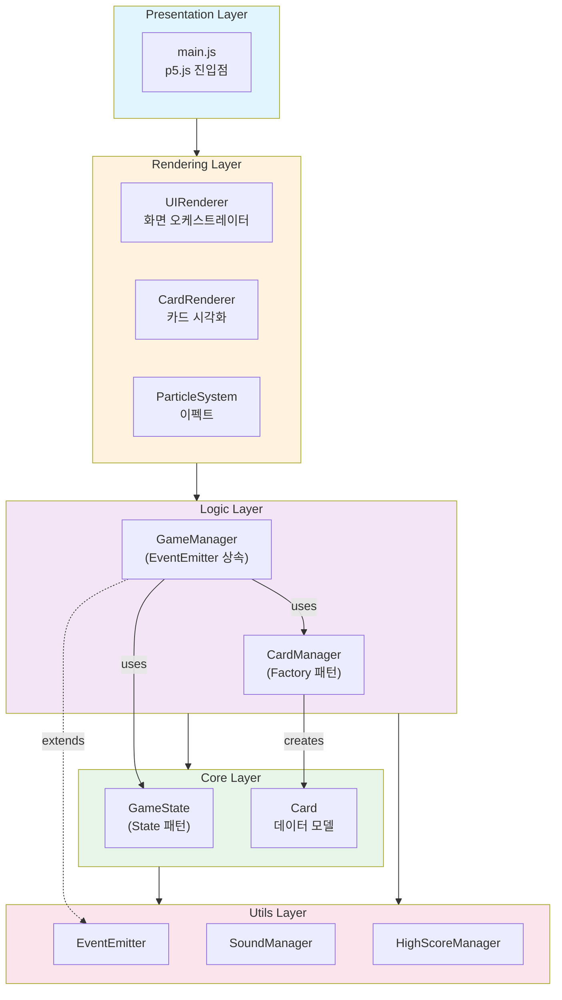
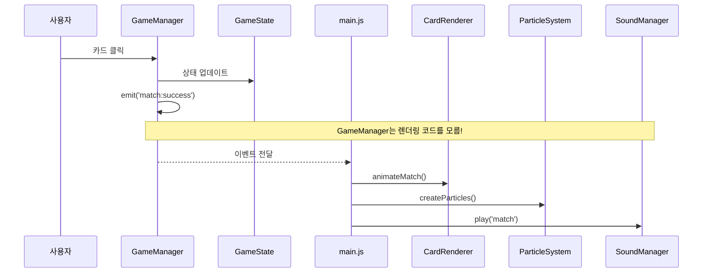
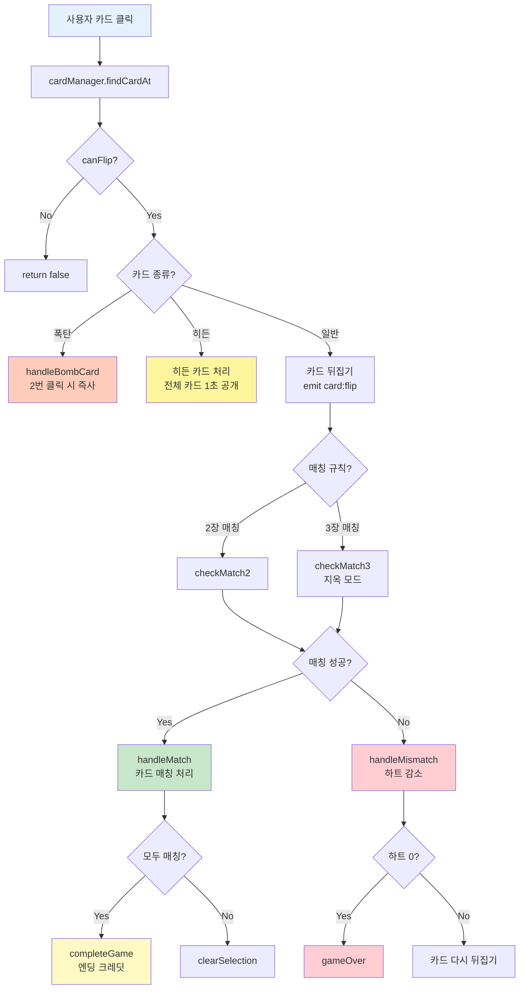

# 카드 매칭 게임 - 기술 발표 자료 (10분)

---

## 목차

1. [프로젝트 소개](#1-프로젝트-소개)
2. [p5.js 게임 루프](#2-p5js-게임-루프)
3. [아키텍처 & 클래스 설계](#3-아키텍처--클래스-설계)
4. [이벤트 시스템](#4-이벤트-시스템)
5. [카드 클릭 흐름](#5-카드-클릭-흐름)
6. [핵심 요약](#6-핵심-요약)

---

## 1. 프로젝트 소개

### 기술 스택

| 분류 | 기술 | 용도 |
|------|------|------|
| **프레임워크** | p5.js 1.7.0 | 캔버스 기반 그래픽/애니메이션 |
| **언어** | Vanilla JavaScript (ES6+) | 순수 JS, 외부 프레임워크 없음 |
| **디자인 패턴** | Observer, Factory, State | 느슨한 결합, 확장성 |
| **아키텍처** | Layered Architecture | 계층 분리, 단방향 의존 |

### 프로젝트 규모

- **총 19개 JavaScript 파일**
- 5개 계층: Presentation → Rendering → Logic → Core → Utils

### 게임 특징

| 기능 | 설명 |
|------|------|
| **4단계 난이도** | 하(8장) / 중(16장) / 상(30장) / 지옥(57장) |
| **특수 카드** | 히든 카드(보너스), 폭탄 카드(페널티) |
| **3장 매칭** | 지옥 모드 전용 규칙 |

---

## 2. p5.js 게임 루프

### 게임의 심장: setup() & draw()

```javascript
function setup() {
    createCanvas(1280, 720);  // 캔버스 생성 (1회 실행)
    imageMode(CENTER);         // 이미지 중심 기준
}

function draw() {
    background(240);           // 매 프레임 배경 클리어
    // 게임 렌더링 (60fps 자동 반복)
}

function mouseClicked() { /* 클릭 이벤트 */ }
function keyPressed() { /* 키보드 이벤트 */ }
```

**핵심 개념**:
- **setup()**: 게임 초기화 (캔버스, 리소스 로드)
- **draw()**: 게임 루프 (60fps로 자동 호출)
- **이벤트 핸들러**: 사용자 입력 처리

### 카드 뒤집기 애니메이션

```javascript
// 3D 뒤집기 효과 구현
push();
translate(card.x, card.y);           // 카드 중심으로 이동
scale(cos(flipProgress * PI), 1);    // X축 스케일로 3D 효과
image(cardImage, 0, 0, width, height);
pop();
```

**변환 함수 활용**:
- **push()/pop()**: 변환 상태 저장/복원 (다른 카드에 영향 X)
- **translate()**: 좌표계를 카드 중심으로 이동
- **scale(cos(...))**: cos 함수로 1→0→-1→0 곡선 = 뒤집기 효과

### 파티클 시스템

```javascript
// 매칭 성공 시 파티클 생성
for (let i = 0; i < 20; i++) {
    particles.push({
        x: cardX, y: cardY,
        vx: random(-3, 3),    // 랜덤 속도
        vy: random(-5, -2),
        life: 1.0
    });
}

// 파티클 렌더링 (페이드 효과)
fill(lerpColor(startColor, endColor, 1 - life));
ellipse(p.x, p.y, size);
```

**애니메이션 함수**:
- **random()**: 파티클 속도/방향 랜덤화
- **lerpColor()**: 색상 보간 (시작색 → 끝색 페이드)
- **millis()**: 시간 기반 애니메이션

---

## 3. 아키텍처 & 클래스 설계

### 계층형 아키텍처 + 클래스 관계



**핵심 원칙**:
- **단방향 의존**: 위 → 아래로만 참조
- **관심사 분리**: 각 계층이 하나의 책임만 담당
- **캡슐화**: private 속성(`_`) + getter

### 적용된 디자인 패턴

| 패턴 | 적용 클래스 | 목적 |
|------|------------|------|
| **Observer** | EventEmitter → GameManager | 이벤트 기반 느슨한 결합 |
| **Factory** | CardManager.createDeck() | 난이도별 카드 덱 생성 |
| **State** | GameState.phase | 게임 상태 머신 (START→PLAYING→RESULT) |

---

## 4. 이벤트 시스템

### Observer 패턴 구현

```javascript
class EventEmitter {
    constructor() {
        this._events = new Map();  // 이벤트명 → 리스너 Set
    }

    on(event, callback) {           // 구독
        if (!this._events.has(event))
            this._events.set(event, new Set());
        this._events.get(event).add(callback);
        return this;
    }

    emit(event, ...args) {          // 발행
        const listeners = this._events.get(event);
        listeners?.forEach(cb => {
            try { cb.apply(this, args); }
            catch (e) { console.error(e); }  // 에러 격리!
        });
    }
}
```

### 이벤트 흐름



### 주요 이벤트 목록

| 이벤트 | 발생 시점 | 리스너 동작 |
|--------|----------|-------------|
| `card:flip` | 카드 뒤집을 때 | 뒤집기 애니메이션 + 효과음 |
| `match:success` | 매칭 성공 | 파티클 + 점수 업데이트 |
| `match:fail` | 매칭 실패 | 실패 애니메이션 + 하트 감소 |
| `hidden:match` | 히든 카드 매칭 | 금색 플래시 + 전체 카드 공개 |
| `game:complete` | 모든 카드 매칭 | 결과 화면 + 엔딩 크레딧 |

---

## 5. 카드 클릭 흐름

### 상세 흐름도



### 특수 카드 시스템

| 카드 종류 | 효과 | 발생 조건 |
|----------|------|----------|
| **히든 카드** | 매칭 시 모든 카드 1초간 공개 | 모든 난이도 (2~3장) |
| **폭탄 카드** | 2번 클릭 시 즉시 게임 오버 | 상/지옥 난이도 |

---

## 6. 핵심 요약

### 아키텍처 & 패턴

| 구분 | 내용 |
|------|------|
| **계층 분리** | Presentation → Rendering → Logic → Core → Utils |
| **Observer** | EventEmitter로 컴포넌트 간 느슨한 결합 |
| **Factory** | CardManager로 난이도별 카드 덱 생성 |
| **State** | GameState.phase로 상태 머신 구현 |

### p5.js 핵심 활용

| 기능 | 활용 |
|------|------|
| **게임 루프** | setup() + draw() 60fps |
| **이벤트** | mouseClicked, keyPressed |
| **변환** | push/pop, translate, scale |
| **애니메이션** | millis(), cos(), lerpColor() |

### 게임 차별화 포인트

| 기능 | 설명 |
|------|------|
| **히든 카드** | 매칭 시 전체 카드 공개 (역전 찬스) |
| **폭탄 카드** | 긴장감 요소 (즉사 위험) |
| **3장 매칭** | 지옥 모드만의 특수 규칙 |

